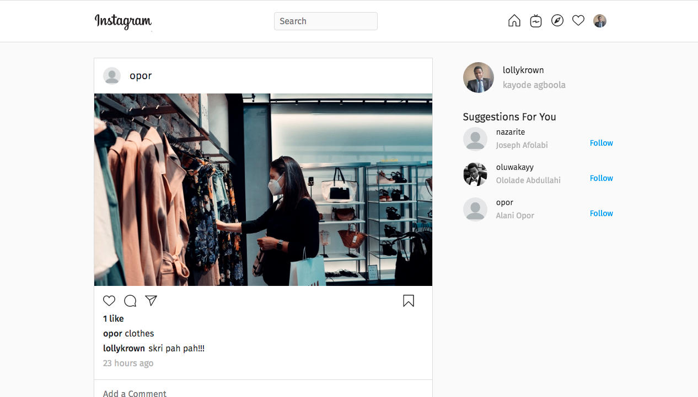
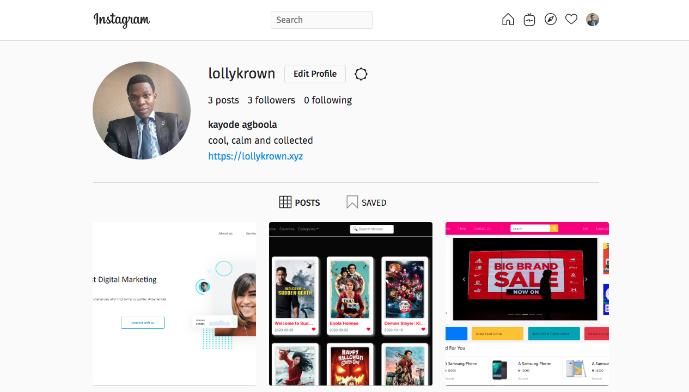

# MERN Projects

This branch is an Instagram clone using MERN stack

The backend repo was built with <a href="https://expressjs.com/">Express</a> and MongoDB. 
Authentication was done with <a href="http://www.passportjs.org/">passport.js</a> which automatically makes it easy to add authentication with google or any other auth options

The backend repo is at [backend](https://github.com/lollykrown/mern-projects/tree/instagram-clone/backend)

It is hosted at <a href="https://mern-backend.herokuapp.com">Nothing to see here</a>

The frontend repo is at [click here](https://github.com/lollykrown/mern-projects/tree/instagram-clone/frontend)

And the frontend is hosted at <a href="https://kay-insta.netlify.app">https://kay-insta.netlify.app</a>

## UI

### Home 

### Post Details

### Profile
